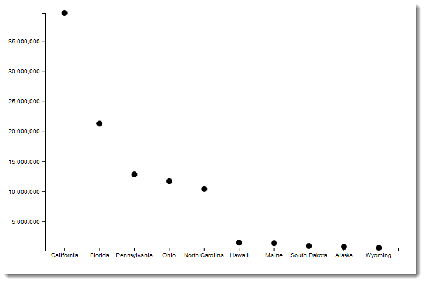
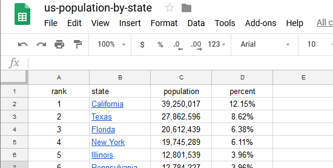

# Population by State

## Get Data

Get list of states from Wikipedia
https://simple.wikipedia.org/wiki/List_of_U.S._states_by_population

1. Copy table with mouse selection. *Note: I was not able to get the headings*
1. paste into Google Sheets
1. Delete unused columns
1. Add headings
1. save file as *state.csv*

## Set Up SVG viewport

In main.js, set the width and height of the chart.

        const width = 600;
        const height = 400;

Set up the margins

        const margin = { left: 100, top: 50, right: 50, bottom: 100 };

Set size of SVG viewport by adding margins to width and height.

        const svgHeight = height + margin.top + margin.bottom;
        const svgWidth = width + margin.right + margin.left;

1. set width and height attributes for SVG Viewport
1. append group `g`
1. transform and translate by the left and top margins

        const svg = d3.select('body').append('svg')
          .attr('width', svgWidth)
          .attr('height', svgHeight)
          .append('g')
          .attr('transform', `translate( ${margin.left}, ${margin.top})`);

## Read in Data

After you read in the data, convert the population strings to integers.

      d3.csv('data/state.csv').then((data) => {
        data.forEach((d) => {
          d.population = +d.population; 
        });

## Create an array called states.

Use the syntax arrayName.push to add an element to the end of the array

      d3.csv('data/state.csv').then((data) => {
        let states = []; 
        data.forEach((d) => {
          d.population = +d.population; 
          states.push(d.state);
        });

## Get minimum and maximum population values

`d3.extent` will return an array with the minimum and maximum values.

    const populationMinMax = d3.extent(data, d => d.population);

## Create y scale

1. use scaleLinear
1. domain is population
1. range is the height of the chart area

        const yScale = d3.scaleLinear()
          .domain(populationMinMax)
          .range([height, 0]);

## Create x scale

1. use scaleBand
1. domain is the array of states you created previously
1. range is the width of the chart area

        const xScale = d3.scaleBand()
          .domain(states)
          .range([0, width])
          .padding(0.1);

## create x axis

1. This does not draw the axis
1. use axisBottom and pass it the xScale

        const xAxis = d3.axisBottom(xScale);

## create y axis

        const yAxis = d3.axisLeft(yScale);

## draw x and y axis

        svg.append('g')
          .call(xAxis)
          .attr('transform', `translate(0, ${height})`);

        svg.append('g')
          .call(yAxis);

## Draw Circles

Bind data to circles.  The sequence is:

1. selectAll
2. data
3. enter
4. append

        svg.selectAll('circle')
          .data(data)
          .enter()
          .append('circle')

The circle tag will appear in the inspector, but will not appear on the screen.

## Add attributes

For cx, apply offset for the bandwidth.

      .attr('r', '5')
      .attr('cy', d => yScale(d.population))
      .attr('cx', (d) => {
        const offset = xScale.bandwidth() / 2;
        return xScale(d.state) + offset;
      });

## Apply Titles

1. chart title
2. y axis title
3. x axis title

